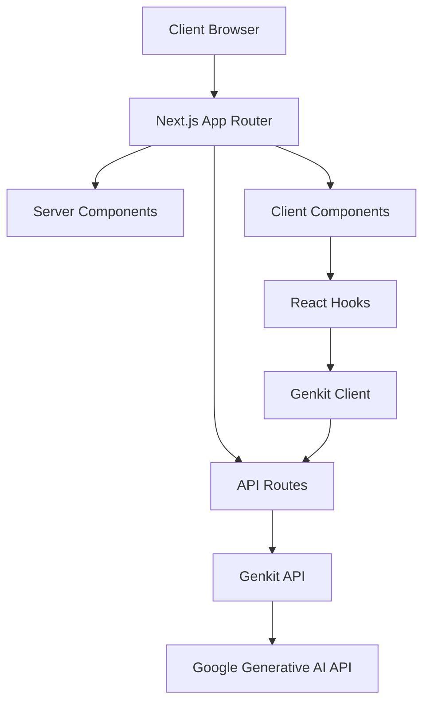

# Architecture Overview

This document provides a comprehensive overview of the Sifra UI application architecture, explaining the key components, their interactions, and the design patterns used.

## System Architecture

Sifra UI follows a modern Next.js-based architecture with the App Router pattern, leveraging server components where appropriate and client components for interactive elements.



## Directory Structure

The application follows a well-organized directory structure:

```
sifra-ui/
├── app/                # Next.js App Router directory
│   ├── api/            # API routes
│   │   └── chat/       # Chat API endpoints
│   ├── layout.tsx      # Root layout component
│   └── page.tsx        # Main page component
├── components/         # Reusable UI components
│   ├── ui/             # Base UI components
│   └── ...             # Feature-specific components
├── lib/                # Utility functions and shared code
│   ├── hooks/          # Custom React hooks
│   └── ...             # Other utilities
├── public/             # Static assets
└── __tests__/          # Test files
```

## Key Components

### Core Components

1. **GenkitChatbot**: The main container component that orchestrates the chat experience, managing conversation state and rendering the chat interface.

2. **ChatList**: Renders the list of chat messages with appropriate styling based on the role (user or assistant).

3. **ChatInput**: Provides the input interface for users to enter messages, with support for submitting, regenerating, and stopping message generation.

4. **Opening**: Displays the welcome screen when no conversation has started yet.

### Client-Side Hooks

1. **useGenkit**: A custom React hook that manages the interaction with the Gemini API, handling:
   - Message state management
   - Streaming responses from the API
   - Error handling
   - Regeneration functionality
   - Conversation history

### Utility Classes

1. **GenkitClient**: A class that abstracts the interaction with Google's Generative AI API, providing methods for:
   - Creating chat sessions
   - Streaming chat responses
   - Managing message formats
   - Handling safety settings

## Data Flow

The application follows a clear data flow pattern:

1. User enters a message in the `ChatInput` component
2. The message is processed by the `useGenkit` hook
3. The hook sends the message to the `GenkitClient`
4. The client formats the message and sends it to Google's Generative AI API
5. Responses are streamed back through the same chain
6. UI updates in real-time as chunks of the response arrive

## API Routes

The application includes an API route at `app/api/chat/route.ts` that:

1. Receives messages from the client
2. Initializes the GenkitClient
3. Processes the messages through the Gemini API 
4. Streams the response back to the client as a ReadableStream

## State Management

State management in Sifra UI is primarily handled using React's built-in state hooks:

1. **Message State**: Managed in the `useGenkit` hook using `useState`
2. **Loading State**: Tracks when a response is being generated
3. **Error State**: Captures and displays any errors that occur during message processing

## Performance Optimizations

Several performance optimizations are implemented:

1. **Edge Runtime**: API routes use Edge Runtime for faster processing and reduced latency
2. **Streaming Responses**: AI responses are streamed in chunks to improve perceived performance
3. **AbortController**: Provides the ability to cancel in-flight requests when needed
4. **Server Components**: Where appropriate, components are rendered on the server to reduce client-side JavaScript

## Security Considerations

The application implements several security measures:

1. **API Key Protection**: Server-side API key storage for secure access to the Gemini API
2. **Content Filtering**: Integration with Google's content safety filters
3. **Input Validation**: Validation of user inputs before processing
4. **Error Handling**: Proper error handling to prevent exposure of sensitive information

## Extensibility

The architecture is designed to be extensible:

1. **Pluggable AI Models**: The GenkitClient can be extended to support different AI models
2. **Customizable UI**: Components are designed with customization in mind
3. **Modular Design**: Clear separation of concerns makes it easy to add or replace functionality
